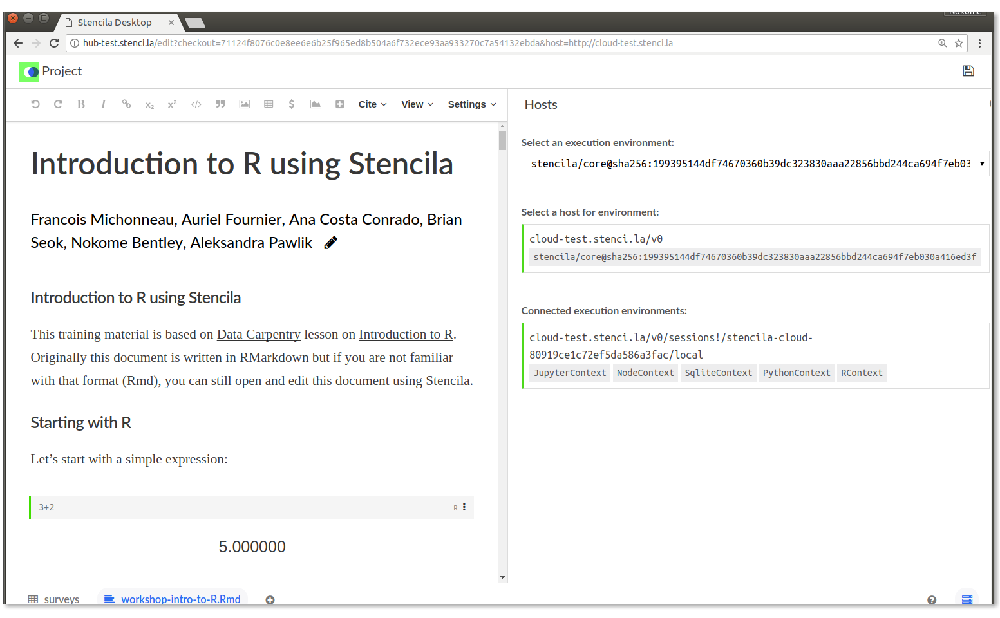

## `stencila/cloud` : Stencila in the cloud

[](http://github.com/badges/stability-badges)
[](https://travis-ci.org/stencila/cloud)
[](https://community.stenci.la)
[](https://gitter.im/stencila/stencila)

## Purpose

In Stencila, execution `Contexts` are provided by a `Host` (if you are familiar with Jupyter, then Stencila `Contexts` are like Jupyter kernels and a `Host` is like a kernel gateway). In addition to providing `Contexts`, `Hosts` can also provide execution `Environments` (which have one or more `Contexts` with in them e.g. `PythonContext`, `RContext`) plus language specific packages (e.g. `pandas`, `ggplot2`). There is a `Host` HTTP API (currently in draft) available [here](https://stencila.github.io/specs/host.html).

This package, `stencila/cloud`, implements the Stencila `Host` API for running alternative execution `Environments` as Docker containers within a Kubernetes cluster. It is intended as a way of providing users of Stencila with an easy way to render Stencila documents withing alternative execution environments, without having to install packages themselves, or install and run Docker.


_An example of a document using a `RContext`, hosted within the `stencila/core` execution environment, provided by `stencila/cloud`._

## Install and deploy

See the [`Dockerfile`](Dockerfile) for building a container and [`deploy.yaml`](deploy.yaml) and [`minikube.yaml`](minikube.yaml) for example Kubernetes deployments.

## Develop

Quickstart:

```sh
git clone https://github.com/stencila/cloud.git
cd cloud
npm install
```

Most development tasks can be run directly from `npm` or via `make` recipes.


Task                       | `npm`                                | `make`          |
---------------------------|--------------------------------------|-----------------|
Install dependencies       | `npm install`                        | `make setup`
Check for lint             | `npm run lint`                       | `make lint`
Run during development     | `NODE_ENV='development' npm start`   | `make run`
Run in production mode     | `npm start`                          | `make run-prod`
Run in a Docker container  |                                      | `make run-docker`
Run on a Minikube cluster  |                                      | `make run-minikube`


## Run locally

Run the `Host` locally in development mode,

```bash
NODE_ENV='development' npm start # or make run
```

or in production mode,

```bash
npm start # or make run-prod
```

### Run with Docker

You can also run the `Host` within a Docker container

```bash
make run-docker
```

### Run with Minikube

Install [`minikube`](https://kubernetes.io/docs/tasks/tools/install-minikube/) and [`kubectl`](https://kubernetes.io/docs/tasks/tools/install-kubectl/). Then start the Minikube cluster,

```bash
minikube start
```

Deploy `stencila/cloud` to the cluster,

```bash
make run-minikube
```

Check the `Deployment` is ready (the dashboard can be useful for this too: `minikube dashboard`),

```bash
kubectl get deployments

NAME                        DESIRED   CURRENT   UP-TO-DATE   AVAILABLE   AGE
stencila-cloud-deployment   1         1         1            0           1d
```

You can then get the URL of the host:

```bash
minikube service stencila-cloud-server --url
```

And check that it responds:

```bash
curl $(minikube service stencila-cloud-server --url)
```

If you're developing the Docker images in the [`stencila/images`](http://github.com/stencila/images) repo you can save time (and bandwidth) by not pushing/pulling images to/from the Docker Hub registry and the Minikube cluster. To do that, configure your local Docker client to use the Docker engine running inside the Minikube cluster:

```bash
eval $(minikube docker-env)
```

[HTTPie](https://httpie.org/) is a useful alternative to Curl for testing the server at the command line because it allows storing session tokens e.g.

```bash
http --session=/tmp/session.json :2000/login?ticket=platypus
```